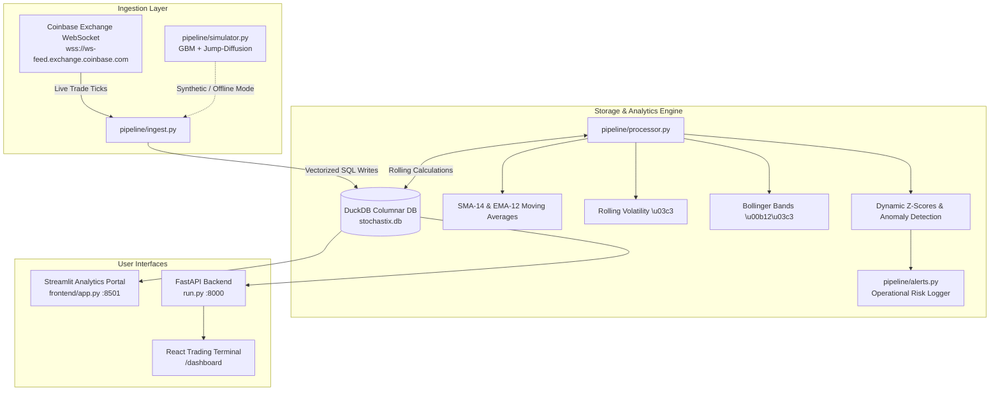

<div align="center">

<!--  ╔══════════════════════════════════════════════════════════╗
      ║              STOCHASTIX  —  HERO HEADER                 ║
      ╚══════════════════════════════════════════════════════════╝  -->


<br/>

<!-- ── Core Stack Badges ── -->
[](https://python.org)
[](https://kalagipandya-stochastix-frontendapp-9bwmcv.streamlit.app)
[](https://fastapi.tiangolo.com)
[](https://duckdb.org)
[](tests/)
[](https://docker.com)
[](.github/workflows)

<br/>

### 🌐 Live Production Application
👉 **[Click Here to Launch Stochastix on Streamlit Cloud](https://kalagipandya-stochastix-frontendapp-9bwmcv.streamlit.app)**

<br/>

> **Stochastix** is a high-throughput cryptocurrency streaming, quantitative time-series analytics, and statistical anomaly detection engine. It connects directly to live exchange WebSocket feeds (`BTC-USD`, `ETH-USD`), writes ticks into an embedded **DuckDB** columnar store, computes rolling statistical indicators in real-time, and surfaces them through both a **Multi-Page Streamlit Analytics Console** and a **FastAPI + Modern React Trading Terminal**.

<br/>

</div>

---

## 🏛️ System Architecture



---

## ✨ Key Capabilities

1. **Sub-Millisecond Stream Ingestion**: Subscribes to exchange WebSocket feeds with resilient ISO-8601 parsing, ping/pong heartbeats, and auto-reconnection.
2. **Embedded Columnar Storage (DuckDB)**: Zero-configuration in-memory/on-disk OLAP columnar queries with sub-2.5ms latency without external database servers.
3. **Quantitative Metrics Suite**:
   - **Simple Moving Average (SMA-14)** & **Exponential Moving Average (EMA-12)**.
   - **Rolling Standard Deviation & Volatility ($\sigma$)**.
   - **Bollinger Bands ($\mu \pm 2\sigma$)**.
   - **Dynamic Z-Score ($Z = \frac{P_t - \mu}{\sigma}$)** with statistical threshold anomaly detection ($|Z| > 2.2$).
   - **Volume Weighted Average Price (VWAP)**.
4. **Merton Jump-Diffusion Simulation Engine**: High-fidelity stochastic market generator (Geometric Brownian Motion + Poisson Jump-Diffusion) for offline demonstrations and testing.
5. **Multi-Page Streamlit Analytics Console**:
   - 🏠 **Control Center Home**: Real-time market tickers, database counter, and module navigation.
   - 📈 **Real-Time Stream Flow**: Live tick charts with dynamic Bollinger Band envelopes and database viewer.
   - ⚡ **Volatility Analysis**: Cross-asset rolling volatility comparison and Z-score distributions.
   - ⚠️ **Anomaly Detection Log**: Real-time flagged statistical events and operational alert log.
6. **FastAPI & React Trading Console**: Full REST API backend with OAuth2 authentication, Swagger docs (`/docs`), health check probe (`/health`), and Recharts frontend.

---

## 📁 Repository Structure

```
Stochastix/
├── app/
│   ├── alerts.py                 # Risk alerting interface
│   ├── analytics.py              # Statistical calculation routines
│   └── dashboard.py              # Streamlit single-page console
├── backend/
│   ├── analytics/                # Multi-node analytical wrappers
│   ├── database/                 # Centralized database connector
│   ├── ingestion/                # WebSocket streaming worker
│   └── main.py                   # Node entrypoint
├── frontend/
│   ├── app.py                    # Streamlit Multi-Page Home (Deployed Entrypoint)
│   └── pages/
│       ├── 1_Dashboard.py        # Real-time streaming price flow & Bollinger Bands
│       ├── 2_Volatility_Analysis.py # Volatility & Z-Score distributions
│       └── 3_Anomaly_Log.py      # Statistical anomalies & operational alerts
├── pipeline/
│   ├── alerts.py                 # Alert recording and DuckDB queries
│   ├── database.py               # DuckDB schema initialization & connection manager
│   ├── ingest.py                 # Coinbase WebSocket live trade ingestion
│   ├── processor.py              # Quantitative rolling metrics & Z-scores
│   └── simulator.py              # GBM + Jump-Diffusion market simulator
├── tests/
│   └── test_system.py            # Pytest test suite (DB, Simulator, Processor, Alerts)
├── .github/workflows/
│   └── ci-cd.yml                 # GitHub Actions automated test & Docker build CI
├── dashboard.html                # Standalone & FastAPI-served React Trading Console
├── run.py                        # Master FastAPI server + WebSocket worker launcher
├── Dockerfile                    # Multi-stage production container
├── docker-compose.yml            # Multi-service container orchestrator
├── render.yaml                   # 1-Click Render cloud deployment blueprint
├── Procfile                      # Cloud process declaration
├── requirements.txt              # Complete Python dependencies
└── README.md                     # System documentation
```

---

## 🚀 Quick Start Guide

### 1. Installation

```bash
# Clone the repository
git clone https://github.com/KalagiPandya/stochastix.git
cd stochastix

# Create and activate virtual environment
python -m venv .venv
source .venv/bin/activate  # On Linux/macOS
# .venv\Scripts\activate   # On Windows

# Install dependencies
pip install -r requirements.txt
```

---

### 2. Running Locally

#### 🟢 Option A: Streamlit Multi-Page Analytics Portal (Deployed Version)

```bash
streamlit run frontend/app.py
```
- Open [http://localhost:8501](http://localhost:8501) in your browser.

#### 🔵 Option B: FastAPI + React Trading Terminal

```bash
python run.py
```
- **React Trading Terminal**: [http://localhost:8000/dashboard](http://localhost:8000/dashboard) (or [http://localhost:8000](http://localhost:8000))
- **Interactive Swagger Docs**: [http://localhost:8000/docs](http://localhost:8000/docs)
- **Default Login**: `admin` / `securepass123`

#### 🟡 Option C: Offline / Simulation Demo Mode

```bash
python run.py --simulate
```

---

## 📡 REST API Reference

| Method | Endpoint | Description | Auth Required |
|---|---|---|---|
| `GET` | `/` or `/dashboard` | Serves the React Trading Terminal | No |
| `GET` | `/health` | Health check probe | No |
| `POST` | `/token` | OAuth2 Authentication & JWT/Bearer token issuance | Form Data |
| `GET` | `/api/market/{symbol}` | Returns rolling metrics, bands, and tick array | Bearer Token |
| `GET` | `/api/alerts` | Returns recent volatility and anomaly alerts | Bearer Token |

---

## 🧪 Unit Testing

Run the automated test suite with pytest:

```bash
python -m pytest tests/ -v
```

```
============================= test session starts =============================
tests/test_system.py::test_database_initialization PASSED                [ 25%]
tests/test_system.py::test_market_simulator PASSED                       [ 50%]
tests/test_system.py::test_processor_metrics PASSED                      [ 75%]
tests/test_system.py::test_alerts_engine PASSED                          [100%]

============================== 4 passed in 1.25s ==============================
```

---

## ☁️ Cloud Deployment

### 1. Streamlit Community Cloud (Live)
- **Live URL**: [https://kalagipandya-stochastix-frontendapp-9bwmcv.streamlit.app](https://kalagipandya-stochastix-frontendapp-9bwmcv.streamlit.app)
- **Repository**: `KalagiPandya/stochastix`
- **Branch**: `main`
- **Main file**: `frontend/app.py`

### 2. Docker & Docker Compose

```bash
docker compose up --build
```
- FastAPI Console: `http://localhost:8000`
- Streamlit Portal: `http://localhost:8501`

### 3. Render.com
- Render automatically detects [`render.yaml`](render.yaml) and deploys both the FastAPI backend and React frontend.

---

<div align="center">

<!--  ╔══════════════════════════════════════════════════════════╗
      ║              STOCHASTIX  —  HERO FOOTER                 ║
      ╚══════════════════════════════════════════════════════════╝  -->


</div>
